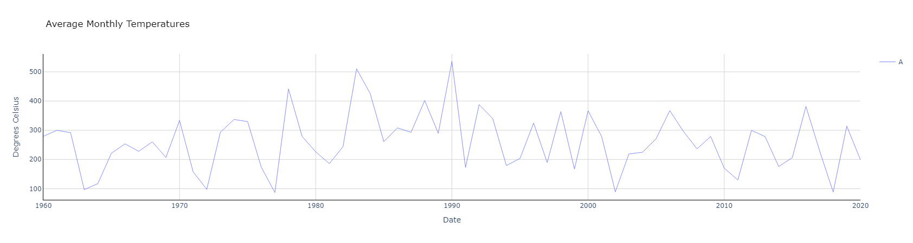
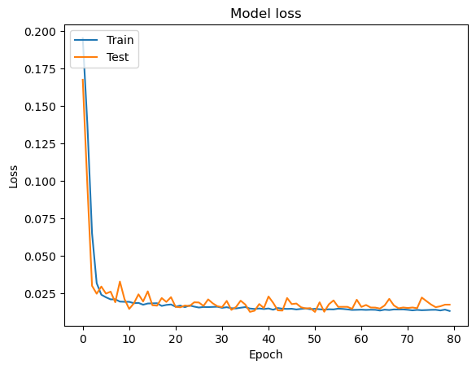
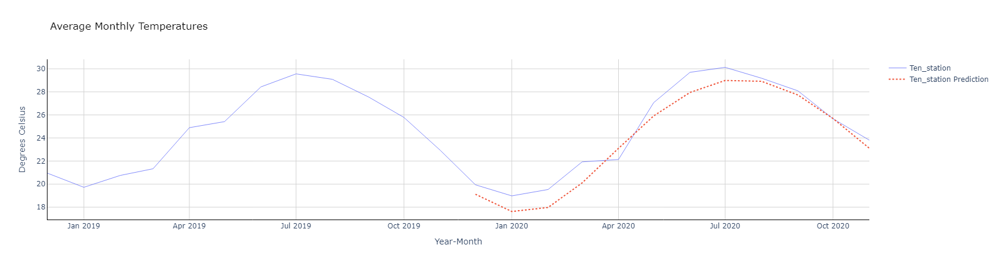

# 台灣測站61年資料建置之GRU溫度預測模型 🌡️

## 專案概述

這是我在碩士研究期間所建置的溫度預測系統，利用台灣10個氣象測站61年的歷史溫度資料，透過GRU (Gated Recurrent Unit) 神經網路進行溫度預測。此模型可以根據過去的溫度資料預測未來月份的平均溫度變化。說實話，這是我研究過程中因為無聊而做的一個小實驗，但結果還蠻有趣的。

## 資料來源與處理

### 資料收集
- 收集台灣氣象測站61年的氣象資料，主要包含：
  - 日期 (Date)
  - 測站位置 (Location)
  - 平均氣溫 (MedTemp)
  - 降水量 (MedRain)
  - PDO (太平洋十年震盪指數)
  - ONI (聖嬰指數)

### 資料預處理
- 使用R語言進行資料清洗與季節性資料分離：
  - 將原始資料依照春、夏、秋、冬四季進行分類
  - 計算月平均溫度
  - 處理缺失值
- 將處理後的資料儲存為不同CSV檔案：
  - all_year.csv: 所有年份的完整資料
  - spring.csv, summer.csv, autumn.csv, winter.csv: 各季節資料

## 資料視覺化

在建立模型前，我先對資料進行了視覺化處理，使用Plotly繪製了歷年溫度變化圖。這個步驟非常重要，因為它讓我能直觀地了解各測站的氣溫分布情況和長期變化趨勢。

```python
# Plot average monthly temperature derived from daily medians for each location
fig = go.Figure()
for location in df2_pivot.index:
    fig.add_trace(go.Scatter(x=df2_pivot.loc[location, :].index, 
                             y=df2_pivot.loc[location, :].values,
                             mode='lines',
                             name=location,
                             opacity=0.8,
                             line=dict(width=1)
                            ))

# 設定圖表樣式和標題
fig.update_layout(dict(plot_bgcolor = 'white'), showlegend=True)
fig.update_layout(title=dict(text="Average Monthly Temperatures", font=dict(color='black')))
fig.show()
```

此圖表清楚地展示了各測站不同年份的溫度變化模式，可以看出台灣各地區的溫度季節性變化和長期趨勢。

## 模型建置

### 技術堆疊
- **主要框架**：TensorFlow/Keras
- **資料處理**：Pandas, NumPy
- **資料縮放**：Scikit-learn 的 MinMaxScaler
- **視覺化**：Plotly, Matplotlib

### 資料準備
為了讓模型能有效學習時間序列數據，我特別寫了一個`shaping`函數來準備訓練資料：

```python
def shaping(datain, timestep, scaler):
    # 函數將資料轉換為GRU可接受的格式
    # 針對每個位置的時間序列資料進行處理
    # 輸出X(輸入)和Y(目標)的時間序列資料
    # ...
```

這個函數處理了以下關鍵步驟：
1. 讀取預處理後的溫度資料
2. 將資料按照時間步長分割成訓練樣本
3. 透過 MinMaxScaler 將資料標準化到 (-1, 1) 範圍
4. 重塑資料為GRU可接受的三維數組格式

### 模型架構
我設計了一個序列到序列的GRU模型結構：

```
Model: "GRU-Model"
_________________________________________________________________
Layer (type)                   Output Shape         Param #
=================================================================
Input-Layer (InputLayer)       [(None, 2, 1)]      0
Hidden-GRU-Encoder-Layer (Bidi [(None, 64)]        7,552
Dropout (Dropout)              [(None, 64)]        0
Repeat-Vector-Layer (RepeatVec [(None, 2, 64)]     0
Hidden-GRU-Decoder-Layer (Bidi [(None, 2, 128)]    49,920
Output-Layer (TimeDistributed) [(None, 2, 1)]      129
=================================================================
Total params: 57,601
Trainable params: 57,601
Non-trainable params: 0
_________________________________________________________________
```

這個架構包含了編碼器-解碼器設計，特別適合處理時間序列的預測任務。使用雙向GRU能夠捕捉溫度時間序列中的前後依賴關係，而Dropout層則有助於減少過擬合的風險。

### 訓練過程
訓練過程中我採用了以下配置：
- **優化器**：RMSprop (學習率 0.001)
- **損失函數**：均方誤差 (MSE)
- **批次大小**：1（因為是時間序列數據）
- **訓練週期**：80
- **驗證分割**：20% 訓練資料用於驗證

## 結果視覺化

### 訓練過程分析
使用Matplotlib繪製了訓練和驗證損失曲線，可以明顯看到模型學習過程中的收斂情況。

### 預測結果
最後，我使用Plotly繪製了預測結果圖表：

```python
fig = go.Figure()

# 繪製實際溫度曲線
for location in dfloc_test.index:
    fig.add_trace(go.Scatter(x=dfloc_test.loc[location, :].index, 
                             y=dfloc_test.loc[location, :].values,
                             mode='lines',
                             name=location,
                             opacity=0.8,
                             line=dict(width=1)
                            ))

# 繪製預測溫度曲線
for i in range(0,pred_test.shape[0]):
    fig.add_trace(go.Scatter(x=np.array(dfloc_test.columns[-timestep:]),
                             y=scaler.inverse_transform(pred_test[i].reshape(-1,1)).flatten(), 
                             mode='lines', 
                             name=dfloc_test.index[i]+' Prediction',
                             opacity=1,
                             line=dict(width=2, dash='dot')
                            ))
```

這個圖表直觀地展示了預測結果與實際溫度的比較，預測曲線（虛線）與實際曲線（實線）的對比讓我們能清楚評估模型的表現。

## 檔案結構
- GRUtest.ipynb: 主要模型訓練和分析程式碼
- GRUtest2.ipynb, GRUtest3.ipynb: 模型的進階版本和實驗
- test.R: 資料前處理 R 程式碼
- all_year.csv: 主要資料集
- 季節資料檔案: spring.csv, summer.csv, autumn.csv, winter.csv

## 結論與反思

這個模型雖然是我在研究過程中出於興趣所建，但經過訓練和測試，確實展現出一定的預測能力。模型能夠根據過去的氣溫數據合理預測未來的氣溫趨勢，特別是對季節性變化的捕捉相當準確。

然而，我也發現在極端天氣或氣候變化劇烈的時期，預測準確度會有所下降。這也提醒了我們，純粹依靠歷史數據的預測模型在面對氣候變化等非穩定因素時，可能需要更多的輔助變量和更複雜的模型架構。

這個專案主要是我個人的興趣所在，提供給大家作為參考。如果你對氣象預測或時間序列分析感興趣，希望這個小實驗能給你一些啟發。

## 可放入圖片的部分

以下部分適合放入相關圖片，增強文章的可視化效果：

1. **61年溫度資料分布** - 可放入原始資料視覺化的圖片，展示台灣各測站61年來的溫度分布情況。

2. **模型訓練過程** - 可放入訓練和驗證損失曲線圖，顯示模型學習過程中的收斂情況。

3. **模型預測結果** - 可放入預測結果與實際值的對比圖，直觀展示模型的預測準確性。

4. **模型架構圖** - 可放入GRU模型架構的視覺化表示，幫助理解模型的結構。

5. **不同季節的預測對比** - 可放入春夏秋冬四季的預測結果對比，展示模型在不同季節的表現差異。
